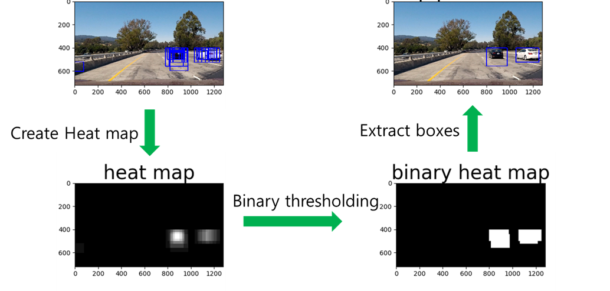
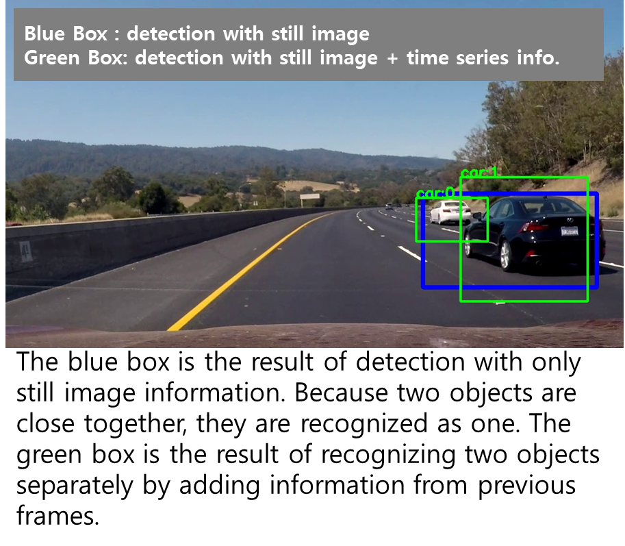
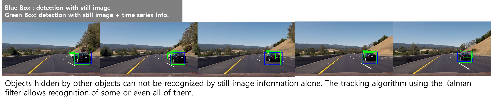

# Vehicle Detection and Tracking

This is Udacity Self-Driving CarND Term 1 Project 5: Video for vehicle detection and tracking. 
I implemented Vehicle Detection and Tracking algorithm using HOG, SVM, and Kalman filter.

## Detection and Tracking Process

### 1. HOG feature extraction

### 2. SVM classfication

The trained classifier is stored at [model_v4.pkl](https://drive.google.com/drive/folders/0B-NpzyGJDuXEVmR4eU1sUnFXVTg) as a binary file.

### 3. Sliding window scanning

The source code for the multiple scale sliding window is [scan module](https://github.com/penny4860/Vehicle-Detection/blob/master/car/scan.py).

## 4. Heatmap operation

The source code for heat map operation is [heatmap module](https://github.com/penny4860/Vehicle-Detection/blob/master/car/heatmap.py).

## 5. Tracking using kalman filter

I implemented the tracking algorithm using the kalman filter by referring to [Simple Online and Realtime Tracking](https://arxiv.org/abs/1602.00763). 

Tracking related source code is [track module](https://github.com/penny4860/Vehicle-Detection/blob/master/car/track.py) and [detect module](https://github.com/penny4860/Vehicle-Detection/blob/master/car/track.py).

### 1) Object located in proximity

### 2) Obscured object tracking

As a result of detection in the still image (blue box), it is impossible to recognize an obstacle in the above situation. However, some improvements can be made using the tracking algorithm. Data association is also performed well.

## How to run

### 1) Still image detection framework

Run [image detection driver](https://github.com/penny4860/Vehicle-Detection/blob/master/car/4_img_detection.py)

### 2) Video detection framework

Run [video detection driver](https://github.com/penny4860/Vehicle-Detection/blob/master/car/5_video_detection.py)

## Result Video

[Youtube Link](https://www.youtube.com/watch?v=DgNtyNuCMbQ)

## Report

[writeup](https://github.com/penny4860/Vehicle-Detection/writeup.md)

